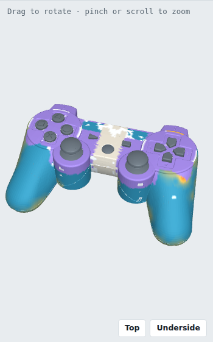
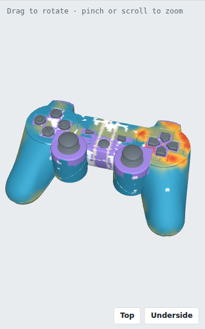

# Finding and closing the grader's blind spots

**Live 3D map:** https://claude.ai/artifact/RWEdixdQpN5UHgjzMpNGs8 (switch between the submitted and the improved check)

The version I submitted is unchanged on `main`. Everything here is an
addition on this branch.

**Scope.** This is a method for finding and closing a grader's blind spots,
shown on one criterion. The same approach applies to every criterion (see
Possible improvements). I started with "no unrequested changes" because it
is the broadest, covering the whole surface the task did not ask to change.
It is also the hardest to grade, since it must tell requested changes from
unrequested ones, and a gap in it is the cheapest for a trained model to
exploit: an edit there costs nothing.

## Why this matters

The grader scores CAD models that an AI makes for this task: widen a game
controller by 15 mm and move its buttons for left-handed use. An AI trained
against a grader learns to exploit whatever the grader does not check, the
way a student learns which topics never come up in the exam.

One of the grader's checks, "no unrequested changes", is there to catch
edits nobody asked for. If it does not look at part of the controller, a
model can change that part freely and still get full marks.

## The problem

The task itself changes the area around the buttons and the strip where the
controller is widened, so the check has to ignore those areas. It ignored
them generously: **about 38% of the controller's outer surface was not
checked at all**, whatever the size of an edit there.

## What I did

1. **Measured it.** A tool places small test edits (bumps from 0.15 to 3 mm
   high and holes, all 8 mm across) at 408 points over the surface, grades
   each one, and paints the result on a 3D model of the controller: the
   Blind-Spot Map.
2. **Narrowed the ignored areas.** Instead of one wide box around each group
   of buttons, a tight zone around each button. The button pads that the
   task moves to the other side are compared with their mirror image, and
   the widened middle is compared with the original cross-section. The old
   check still runs alongside and the lower score counts, so the new
   version can only catch more, never less. This is Tight Zones.
3. **Proved it.** A before and after audit on the same 408 points with
   rules fixed in advance: the correct solution keeps full marks, no wrong
   model scores higher, no harmless edit is flagged, and nothing caught
   before is missed now. All rules pass.

## Result

<table><tr>
<td width="50%"><br>Submitted check. Purple: not checked.</td>
<td width="50%"><br>Tight Zones. Far less purple.</td>
</tr></table>

Blue means test edits are caught, red means they are missed.

| Same 408 points | Submitted | Tight Zones |
|---|---:|---:|
| Outer surface not checked | 38% | **15%** |
| Points checked | 258 | **326** |
| 3 mm bump caught | 256 | **315** |
| Hole caught | 244 | **298** |
| 0.15 mm step caught | 223 | **258** |
| False alarms on harmless edits | 1 | 1 |

Also confirmed:

- **A live SolidWorks run** scores the correct solution 8.0 of 8.0.
- **All 10 shipped models** keep their ranking, and none scores higher.
  Their scores are in `evidence/envelopes_tight_zones/`.
- **The shipped self-test** passes 88 of its 90 checks. The two it flags
  are the small double penalty listed under Possible improvements.

## Possible improvements

Each of these is a known, scoped next step. Every change to the grader goes
through the same audit (about 2.5 hours per run), so I shipped one change
proven end to end rather than several partly checked ones.

- **Apply the method to every criterion.** Plant a controlled mistake in
  the correct solution and check that the right criterion catches it, and
  only that one: widen by 10 to 30 mm, shift one button by 0.5 to 5 mm,
  push a button into the wall, remove a button symbol, mirror the whole
  part naively, break a few features. Each criterion then gets a measured
  sensitivity, for example "catches a button shifted by X mm". This runs
  offline on the saved measurements, about 2 to 3 days for all criteria,
  plus a fix wherever a gap is found.
- **Test on a second correct solution.** All thresholds were checked on the
  one reference solution provided. Building a second solution in a
  different way and running the audit on it is the best guard against
  penalising a correct model. It needs a new SolidWorks model, so it is the
  next validation step rather than more tuning on one part.
- **Close the last weak spot, on top of the moved D-pad.** The reference
  rebuilds the button seats there, so there is no original surface to
  compare with, and at 7 points none of the test edits is caught. The
  likely fix is to compare those seats with their mirror image on the
  original part, the method that already works for the button pads.
- **Remove a small double penalty.** On models whose buttons were never
  moved, one patch of about 23 mm² is flagged (0.018 points, no change in
  ranking). Those models already lose points for not moving the buttons.
  The likely fix is to place the tight zones only where buttons actually
  moved.
- **Make it faster.** Running both checks takes about 54 s per model
  instead of 22 s, and longer on heavily broken models. Keeping the old
  check is what guarantees "never catches less" today. Once the second
  solution confirms Tight Zones, the old check can be dropped.

## Files

| Where (under `test_example/`) | What |
|---|---|
| `SolidWorks/1_playstation_controller/tests/task/harness_tight_zones/` | The improved grader, used exactly like the submitted one |
| `SolidWorks/1_playstation_controller/evidence/blindspot/` | The 3D map (open in a browser), the before and after report, pictures |
| `SolidWorks/1_playstation_controller/evidence/envelopes_tight_zones/` | Scores of the 10 shipped models |
| `tools/blindspot_map.py`, `tools/blindspot_audit.py`, `tools/BLINDSPOT_AUDIT.md` | The map, the audit and how to run them |

## Run it

```bat
cd test_example\SolidWorks\1_playstation_controller
python tests\task\harness_tight_zones\harness.py solution\solution.SLDPRT
```

The audit runs without SolidWorks, from the saved measurements:

```bash
cd test_example
python3 tools/blindspot_audit.py run audit/before
BLINDSPOT_HARNESS=SolidWorks/1_playstation_controller/tests/task/harness_tight_zones/harness.py \
  python3 tools/blindspot_audit.py run audit/after --spots-from audit/before
python3 tools/blindspot_audit.py compare audit/before audit/after
```
